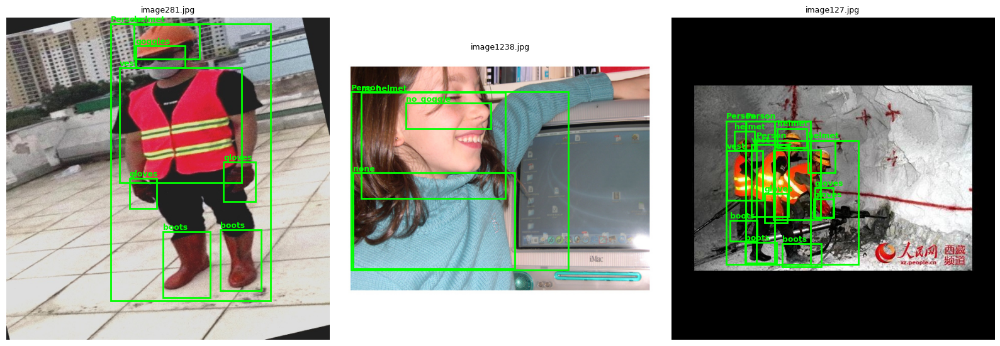
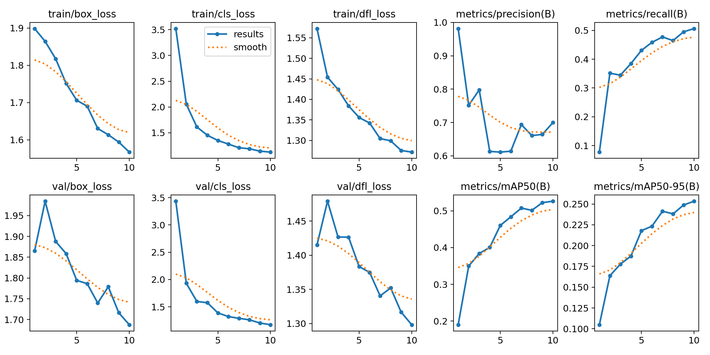
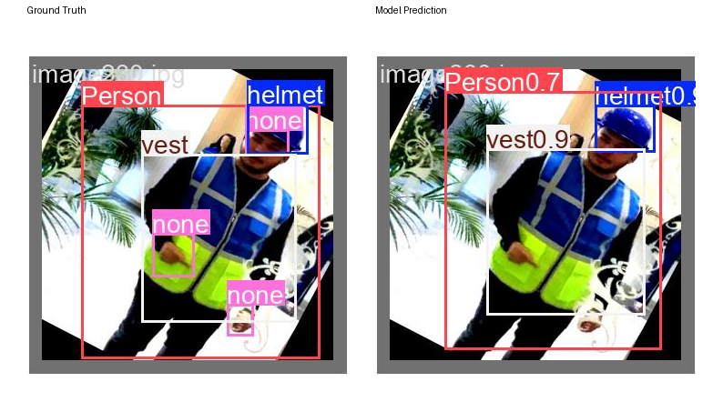
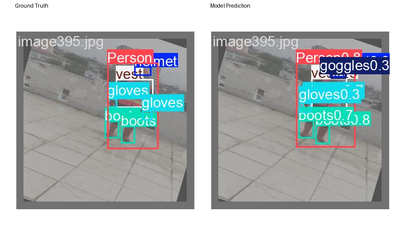
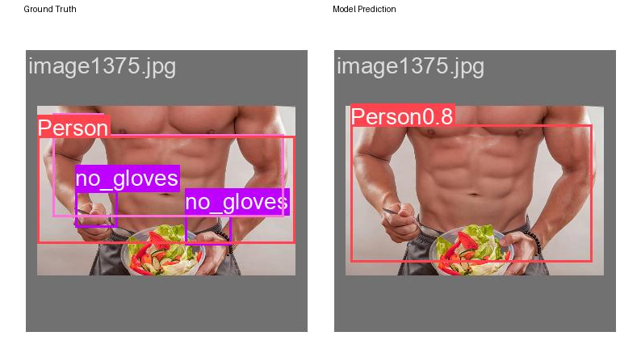
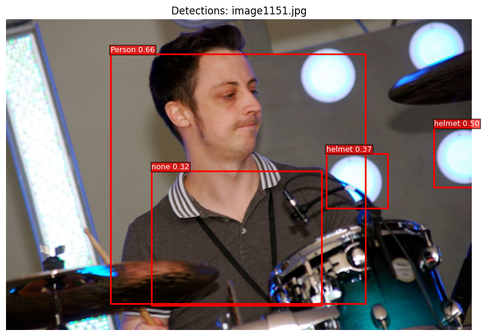

# PPE Compliance Checker — Multi-Agent Computer Vision System

**Computer Vision Capstone Project (Tier 3)**

**Author:** Mary Ann Mastri

---

## 1. Overview

This project is a three-agent computer vision system that checks construction-site
photos for PPE (personal protective equipment) compliance. It doesn't just run a
detector on an image — it perceives (detects PPE items), reasons (decides whether
the scene is compliant, and why), and acts (produces an annotated image, a JSON
report, and a console alert for violations).

This satisfies **Tier 3** on two independent grounds:
1. **True multi-agent system** — three agents with distinct roles that pass
   structured messages (plain Python dicts / JSON) to one another.
2. **Custom-trained CV model** — a YOLO11n object detector fine-tuned from scratch
   on a PPE dataset, exported to ONNX, and used for inference.

## 2. Architecture

```
   image
     │
     ▼
┌─────────────────────┐   list of {class, confidence, bbox}
│  Perception Agent    │ ─────────────────────────────────────┐
│  (YOLO11 ONNX model) │                                       │
└─────────────────────┘                                       ▼
                                                    ┌───────────────────────┐
                                                    │  Compliance Agent      │
                                                    │  (rule-based reasoning)│
                                                    └───────────────────────┘
                                                                │
                                          {compliant, violations, missing, detected}
                                                                │
                                                                ▼
                                                    ┌───────────────────────┐
                                                    │  Reporter Agent        │
                                                    │  (produces output)     │
                                                    └───────────────────────┘
                                                                │
                                     annotated image + JSON report + console alert
```

| Agent | Role | Input → Output |
|---|---|---|
| **Perception Agent** | Runs the fine-tuned YOLO11 ONNX model on an image | image → list of `{class, confidence, bbox}` detections |
| **Compliance Agent** | Rule-based reasoning over detections | detections → `{compliant, violations, missing, detected}` |
| **Reporter Agent** | Produces the useful output | compliance result → annotated image + JSON report (+ console alert for violations) |

Each agent only ever sees the *structured output* of the agent before it — never
raw pixels it didn't produce itself — except the Perception Agent, which is the
only one that touches the image. This is enforced by the message schema, not
just convention: `compliance_agent()` takes a list of detection dicts, not an
image; `reporter_agent()` takes the compliance dict, not the raw model output.

## 3. Repository Structure

```
ppe-compliance-agent/
├── README.md                     ← you are here
├── docs/
│   └── AI_usage_log.md           ← how AI tools were used while building this
├── models/                       ← trained weights, ready to use without retraining
│   ├── ppe_yolo11n_10ep320px.pt    PyTorch checkpoint (smoke-test run)
│   └── ppe_yolo11n_10ep320px.onnx  ONNX export — what the agent notebook actually loads
├── notebooks/
│   └── PPE_Compliance_Agent.ipynb ← full pipeline: setup → train → export → agents → eval
└── results/                      ← ALL metrics, curves, and example outputs live here
    ├── README.md                 ← full index
    └── smoke_test_10ep_320px/    ← the training run used for every result in this repo
```

See [`results/README.md`](results/README.md) for the full index of metrics,
training curves, and example success/failure/false-positive/false-negative
outputs — that folder is the single place everything lives.

## 4. Dataset

Trained on Ultralytics' own
[Construction-PPE dataset](https://docs.ultralytics.com/datasets/detect/construction-ppe)
— 1,416 images (1,132 train / 143 val / 141 test), 178.4 MB, 11 classes:

- **Worn:** `helmet, gloves, vest, boots, goggles`
- **Missing/violation:** `no_helmet, no_gloves, no_boots, no_goggle`
- **Other:** `Person, none`

No API keys, tokens, or logins are required. Referencing `construction-ppe.yaml`
in Ultralytics' training code downloads and unpacks the dataset automatically
from a public GitHub release.

<p align="center">
  <br>
  <em>Sample training images with ground-truth PPE labels.</em>
</p>

## 5. Model Training

- **Base checkpoint:** `yolo11n.pt` (COCO-pretrained, fine-tuned on Construction-PPE)
- **Framework:** Ultralytics YOLO11, exported to ONNX for inference (`onnxruntime`, CPU provider)
- **Configuration used:** 10 epochs, 320px image size

This started as a smoke-test configuration — intentionally small, to verify the
full pipeline (train → export → agents → reports) end-to-end before committing
GPU hours to a longer run. A longer, higher-resolution run (50 epochs, 640px)
was attempted but not completed: Google Colab's runtime proved too unstable
across repeated sessions (frequent disconnects and resets) even after
purchasing additional compute units, and it was not reliable enough to finish
before the deadline. **The results in this repository are from the 10-epoch/
320px run** — this is the final, submitted model, not a placeholder. See
Section 9 (Known Limitations) and [`docs/AI_usage_log.md`](docs/AI_usage_log.md)
for the full account of why.

The trained weights are checked into this repo at
[`models/ppe_yolo11n_10ep320px.pt`](models/ppe_yolo11n_10ep320px.pt) (PyTorch)
and [`models/ppe_yolo11n_10ep320px.onnx`](models/ppe_yolo11n_10ep320px.onnx)
(ONNX, what the agent notebook loads for inference) — no need to retrain to
try the agent pipeline.

## 6. Evaluation Results

Validation set: 143 images, 1,172 ground-truth instances.

**Smoke-test run (10 epochs, 320px):**

| Metric | Value |
|---|---|
| mAP50 | 0.524 |
| mAP50-95 | 0.253 |
| Mean Precision | 0.710 |
| Mean Recall | 0.504 |

| Class | Precision | Recall | mAP50 | mAP50-95 | Instances |
|---|---|---|---|---|---|
| helmet | 0.786 | 0.746 | 0.768 | 0.403 | 201 |
| gloves | 0.698 | 0.632 | 0.672 | 0.308 | 136 |
| vest | 0.768 | 0.830 | 0.842 | 0.495 | 171 |
| boots | 0.735 | 0.702 | 0.733 | 0.401 | 151 |
| goggles | 0.736 | 0.723 | 0.745 | 0.266 | 47 |
| none | 0.578 | 0.531 | 0.506 | 0.207 | 81 |
| Person | 0.775 | 0.879 | 0.876 | 0.515 | 239 |
| no_helmet | 0.473 | 0.378 | 0.331 | 0.109 | 45 |
| no_goggle | 1.000 | 0.048 | 0.161 | 0.046 | 41 |
| no_gloves | 0.256 | 0.071 | 0.126 | 0.035 | 56 |
| no_boots | 1.000 | 0.000 | 0.000 | 0.000 | 4 |

<p align="center">
  <br>
  <em>Loss and precision/recall/mAP curves, 10 epochs / 320px (final run).</em>
</p>

Full per-class breakdown: [`results/smoke_test_10ep_320px/metrics.csv`](results/smoke_test_10ep_320px/metrics.csv)

### Honest analysis

The **worn-PPE classes** (`helmet`, `vest`, `boots`, `goggles`, `Person`) trained
reasonably well even in 10 epochs, with mAP50 in the 0.67–0.88 range. The
**explicit violation classes** (`no_helmet`, `no_goggle`, `no_gloves`, `no_boots`)
are much weaker — recall is especially poor (as low as 0.0 for `no_boots`, which
only has 4 validation instances). This is expected: those classes are rarer in the dataset, visually more
ambiguous (the model has to notice an *absence*, not a distinct object), and
10 epochs at 320px is not enough training signal to learn them reliably. This
was the known tradeoff of the training configuration that ended up being the
final one — see Section 5 for why a longer run wasn't achievable in the
available time. Given more epochs and resolution, recall on the violation
classes would be the first thing expected to improve.
The confusion matrix (`results/smoke_test_10ep_320px/diagnostics/confusion_matrix.png`)
also shows real cross-talk between visually similar head-region classes,
particularly `helmet` and `goggles` — see Section 7 for a concrete example.

## 7. Example Outputs

All three cases below are real held-out validation images, shown as ground
truth vs. model prediction side by side (via Ultralytics' `val_batch` output),
so every claim is directly checkable against the source image. Full write-up
and the underlying confusion-matrix evidence: [`results/README.md`](results/README.md).

### Success case

<p align="center">
  
</p>

Ground truth: `Person, helmet, vest`. Prediction: `Person 0.7, helmet 0.9,
vest 0.9` — all three main PPE classes correctly detected with high
confidence on a single, unoccluded worker in typical construction-site framing.

### Failure case 1 — misclassification (helmet ↔ goggles)

<p align="center">
  
</p>

Ground truth: `Person, helmet, vest, gloves x2, boots x2`. Prediction: `Person
0.8, goggles 0.3` (wrong — should be `helmet`), `vest`, `gloves 0.3`, `boots
0.7/0.8`. This isn't a one-off: the validation confusion matrix shows real
cross-talk between `helmet` and `goggles` in both directions (~7 instances
each way) — both are small, head-region objects the 10-epoch/320px model
hasn't yet learned to separate reliably.

### Failure case 2 — false negative (missed violation)

<p align="center">
  
</p>

Ground truth: `Person, no_gloves x2`. Prediction: `Person 0.8` only — both
violation boxes were missed entirely. This is the most consequential failure
mode for a compliance system: the Compliance Agent would report this scene as
fully compliant when it isn't. Consistent with `no_gloves` being one of the
weakest classes in the metrics (recall 0.071, mAP50 0.126).

### Failure case 3 — out-of-domain false positive

<p align="center">
  
</p>

A `helmet 0.50` box placed on a stage light with no person underneath it, on a
non-construction test photo (a drummer on stage). This model generalizes
poorly outside its training domain, and bright circular light fixtures get
confused with helmets. **Mitigations across all three failure modes:** raising
the confidence threshold, training longer at higher resolution (not achievable
here — see Section 5), and restricting deployment to in-domain imagery.

## 8. How to Run

**Option A — quick test, no training required.** `models/ppe_yolo11n_10ep320px.onnx`
is the actual trained smoke-test model, ready to use. Open the notebook, run
just the setup and utility cells (imports, `letterbox`/`preprocess`/
`decode_yolo_onnx`, and the three agent-definition cells), point
`onnx_model_path` at `models/ppe_yolo11n_10ep320px.onnx` instead of a freshly
exported one, and run the Section 8/9 pipeline directly on any image. No GPU,
no dataset download, no training wait.

**Option B — full pipeline from scratch:**
1. Open `notebooks/PPE_Compliance_Agent.ipynb` in Google Colab.
2. `Runtime → Run all`. No API keys, tokens, or accounts are required anywhere —
   the dataset download is fully public and automatic (~178MB).
3. Section 4's Google Drive mount is optional — only used to persist trained
   weights across Colab sessions. Skip it if you don't need that.
4. The notebook's default training config is 10 epochs / 320px (`Cell 5.0`) —
   the same configuration used for every result in this repo. Colab's
   free/paid runtime proved unstable in practice; budget accordingly if
   attempting a longer run.
5. Sections 8–9 run the three-agent pipeline over a batch of validation images
   and produce the dashboard shown above. Reports land in
   `/content/ppe_multi_agent_outputs/` inside Colab.

## 9. Known Limitations

- **Training budget was constrained by Colab instability, not by choice.**
  The model was trained for only 10 epochs at 320px. A longer, higher-resolution
  run (50 epochs, 640px) was attempted multiple times but never completed —
  Colab's runtime disconnected or reset repeatedly, including after purchasing
  additional compute units. This directly limits the numbers in Section 6: more
  training would likely improve the violation classes in particular.
- Violation classes (`no_helmet`, `no_gloves`, `no_goggle`, `no_boots`) are
  underrepresented in the dataset and are the weakest part of the model —
  see Section 6.
- The confusion matrix shows real cross-talk between visually similar
  head-region classes (`helmet` and `goggles`) — see Section 7.
- The Compliance Agent's rules are simple set-membership logic (required PPE
  present, no explicit violation class detected) — it doesn't reason about
  *which person* is missing *which* item in a multi-person scene; it flags the
  scene as a whole.
- Trained and evaluated on a single public dataset; not validated against a
  different construction-site camera/lighting setup.

## 10. AI Usage

See [`docs/AI_usage_log.md`](docs/AI_usage_log.md) for a full account of how AI
tools were used throughout this project.

## 11. Reproducing This Project

Same as Section 8 above — clone this repo, open the notebook in Colab, `Run all`.
Total cost: no paid APIs required beyond Colab compute time (see Section 5 and
the AI usage log for how much this project actually used).
